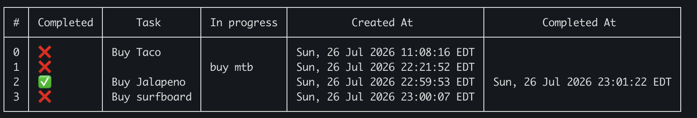

# Todo Project

A lightweight, high-performance command-line task manager built in Go. Designed with explicit status state transitions (**Pending** $\rightarrow$ **In-Progress** $\rightarrow$ **Completed**) and a ring-buffered historical archive for completed task management.

> Built with Go 1.18+ featuring **Go Generics** for generic JSON storage abstraction and terminal table rendering.

---

## Overview



---

##  Features

* **State-Gated Workflow:** Tasks follow a structured lifecycle: `Pending` $\rightarrow$ `In-Progress` $\rightarrow$ `Completed`.
* **Generic Storage Layer:** Reusable `Storage[T]` type wrapper for type-safe JSON persistence.
* **Ring-Buffered History:** Automatically archives up to 25 completed tasks in `history.json` via the `-close` flag.
* **Terminal Table UI:** Formatted output with real-time timestamping for task creation and completion.

---

## 🛠️ Installation

Ensure you have [Go](https://go.dev/) installed (v1.18 or higher).

```bash
# Clone the repository
git clone [https://github.com/yourusername/go-task-cli.git](https://github.com/yourusername/go-task-cli.git)

# Navigate into the project
cd go-task-cli

# Install dependencies
go mod tidy

# Build the executable
go build -o task

# List all current tasks
./task -list

# Add a new task (starts in Pending state)
./task -add "Implement user authentication"

# Move a task to In-Progress (e.g., index 0)
./task -inpro 0

# Mark an In-Progress task as Completed
./task -toggle 0

# Edit a task title (id:newTitle)
./task -edit "0:Implement OAuth2 authentication"

# Delete a task by index
./task -delete 0

# Archive completed tasks to history.json
./task -close
```
## Workflow

[ Pending ]  ---(-inpro)-->  [ In-Progress ]  ---(-toggle)-->  [ Completed ]
     ^                              |
     |-------(-inpro / toggle)------|

## Todo
- 
- fuzzy finder??
- BubbleTea??
